# Using Visual Studio 2017 with a Toradex Colibri i.MX 6UUL device
## Prerequisites
* [Colibri with Wifi/BT](https://www.toradex.com/computer-on-modules/colibri-arm-family/nxp-imx6ull) and an [Aster Carrier Board](https://www.toradex.com/products/carrier-boards/aster-carrier-board)
* [Setup your board](https://developer.toradex.com/getting-started?som=colibri-imx6ull&board=aster-carrier-board)
* [TI SensorTag](http://www.ti.com/ww/en/wireless_connectivity/sensortag/)
* [Visual Studio 2017](https://www.visualstudio.com/vs/) (any edition) with the [Linux workload](http://aka.ms/vslinux) installed 
* [Docker for Windows](https://store.docker.com/editions/community/docker-ce-desktop-windows)

## Create a VS Project
Get started by creating a blank Linux project. Go to File > New > Project, then select Visual C++ > Cross Platform > Linux and select the blank template. Here we are naming the project imx6-Bluetooth.

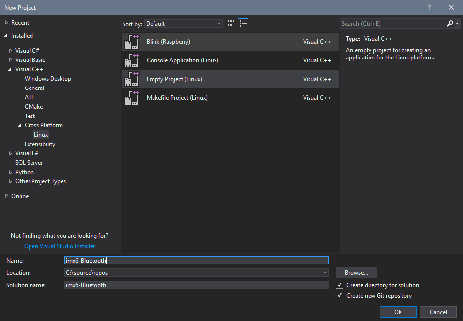

## Create a build container
For this demo we are going to use containers for setting up our build enviornment. First pull the container image locally from the registry.
```
docker pull jeremiascordoba/development:SDK
```

We created the project first so we have our directory where our source will live. We will map that into the container. I saved mine here: `C:\source\repos\imx6-Bluetooth\imx6-Bluetooth`. Note that is the project directory, not the top level solution directory. In the next command adjust that value to match where you saved your project.
```
docker run -d -p 2222:22 --name colibri_sdk -v C:\source\repos\imx6-Bluetooth\imx6-Bluetooth:/root/projects/imx6-Bluetooth jeremiascordoba/development:SDK
```
You should now have a running container named colibri_sdk on your system that contains the build tools and has an open SSH port for Visual Studio to issue commands over.

## Connect Visual Studio to the container and device
In Visual Studio go to Tools > Options > Connection Manager

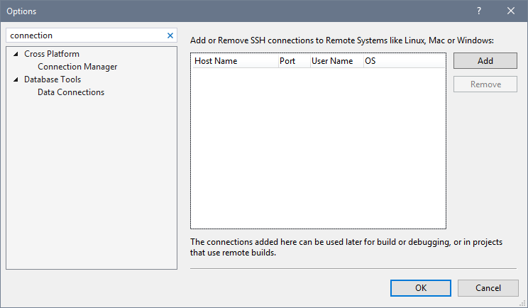

Click add and enter 
* Host name: localhost 
* Port: 2222 
* User: root 
* Password: toradex_sdk

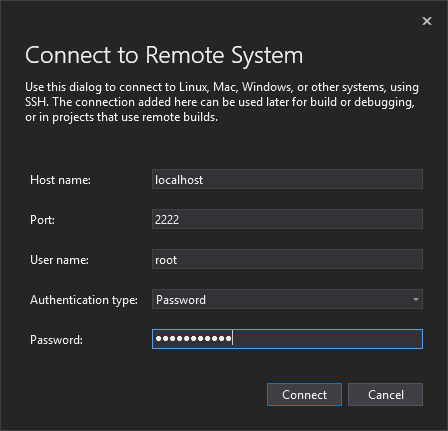

Visual Studio automatically queries the compiler to get include locations and compiler flags to provide machine specific IntelliSense. However the cross compilers we are using are not built with this information. We can manually provide the include locations though. After the connection is complete expand the node under Connection Manager and select Remote Headers IntelliSense Manager.

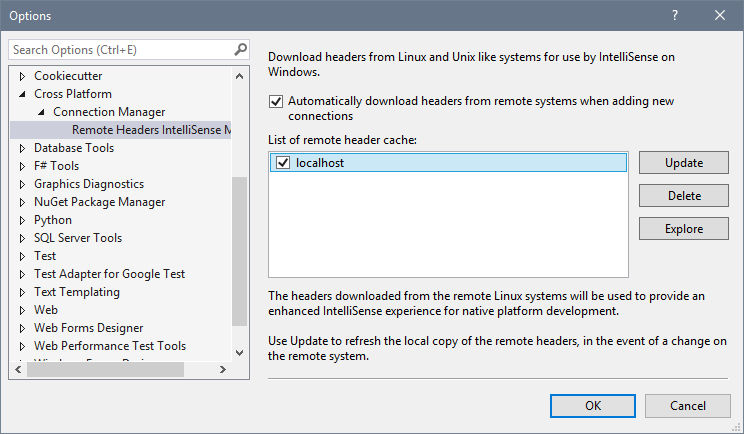

Select Explore. This brings up Windows Explorer. Copy the file settings.xml.unused and name it settings.xml. Open the file in a text editor and change the value of useCompiler to false. Now add the following location to includeDirs at the beginning of the CDATA block:
```
/usr/local/oecore-x86_64/sysroots/armv7at2hf-neon-angstrom-linux-gnueabi/usr/include;
```

Save the file. Keep this explorer window open though as you will need this path later in the instructions. 

In Visual Studio click Update in the Remote Headers IntelliSense Manager. You'll notice this will take a moment longer than when we established the connection as we're now getting a full set of headers back. When it is done click Connection Manager and add the connection to your device. Use the IP address, root for the user and leave password blank. You will get an error that Visual Studio could not find the compiler to get the headers from the target. That's OK as we're not going to compile on this device, only deploy.

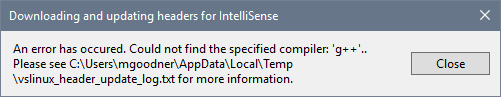

Select Close to dismiss the error, and OK again to exit the Options dialog.

## Add some source and cross compile it in a container
We're using a sample from this SensorTag repo: [durovsky/SensorTag2650](https://github.com/durovsky/SensorTag2650). We only using the source here for talking to the SensorTag, not the whole project. Copy src\senortag.cpp and include\filepaths.h locally into your VS project directory. Right click the project in the solution explorer and click add > existing item. Select the files you just added. You project should now look like this.

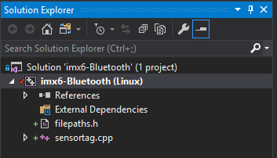

Look at filepaths.h. Make sure the path to where the file will live on your device exists. 

Now we need to tell Visual Studio how to compile for the ARM target board. Right click the project and click properties. We have mapped our project directory into the container, so select the copy sources node and change the default to no. The build container we are using has aliased gcc to the cross compilers, so we do not need to override the default values for the compiler in this project. Expand the c++ node and select command line. Add the following:
```
-march=armv7-a -mthumb -mfpu=neon -mfloat-abi=hard --sysroot=/usr/local/oecore-x86_64/sysroots/armv7at2hf-neon-angstrom-linux-gnueabi 
```
Expand the Linker node and under General change Copy Output to No. Select command line and add the same line as above.
```
-march=armv7-a -mthumb -mfpu=neon -mfloat-abi=hard --sysroot=/usr/local/oecore-x86_64/sysroots/armv7at2hf-neon-angstrom-linux-gnueabi 
```

Now try and build the project to validate things work so far. If anything is amiss carefully check the your settings against the above.

So far we have setup a build container, connected it and our device to Visual Studio, and cross compiled an executable in the container that can run on the ARM development board. Now we need to get the output to the board.

## Copying the cross compiled output to the i.MX 6ULL device
We are going to add another project to copy the cross compiled output to our remote device. In the Solution Explorer, right click the solution, then Add > New Project. In the dialog select Makefile. 

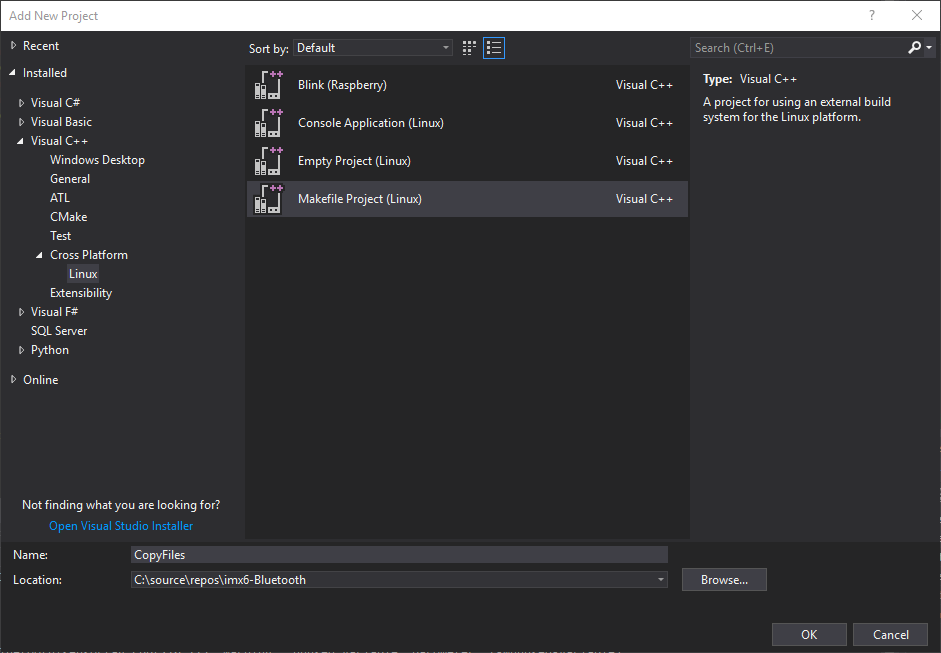

We are organizing our solution such that there is a project used for building and debugging source (imx6-Bluetooth), and another (CopyFiles) to copy outputs to a remote ARM target. The trick here is that we use the x64 configuration for build and ARM for debug. In the solution properties under Project Dependencies we will set the project CopyFiles to depend on CrossCompileProject. Right click the solution and select properties. Now select Project Dependencies and set CopyFiles to depend on imx6-Bluetooth.

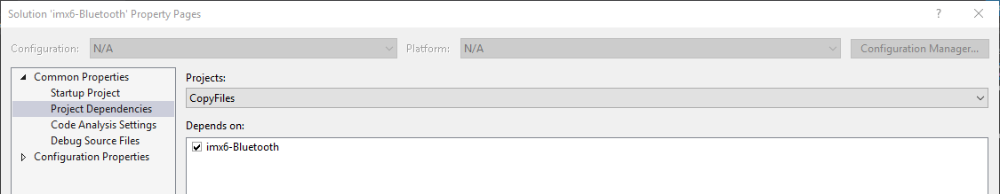

Now under configuration properties change CopyFiles to use ARM but leave everything else x64.

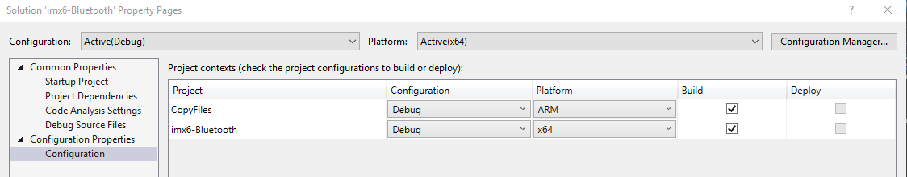

While we are here change Platform to ARM and unselect Build for everything. This allows us to change the imx6-Bluetooth platform to ARM for debugging the device but not kick off a build. That's what our x64 project using the cross compilers in the container is for.

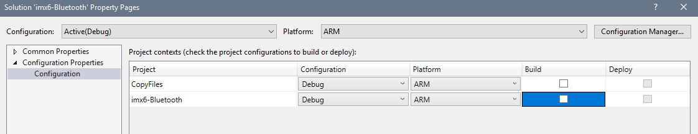

Close the solution property pages.

Now, right click the imx6-Bluetooth project and select properties. Make sure the x64 platform is active. Go to Build events > Post Build Events and add the following command line.
```
copy "$(ProjectDir)bin\$(Platform)\$(Configuration)\$(ProjectName).out" "$(ProjectDir)bin\ARM\$(Configuration)\$(ProjectName).out"
```
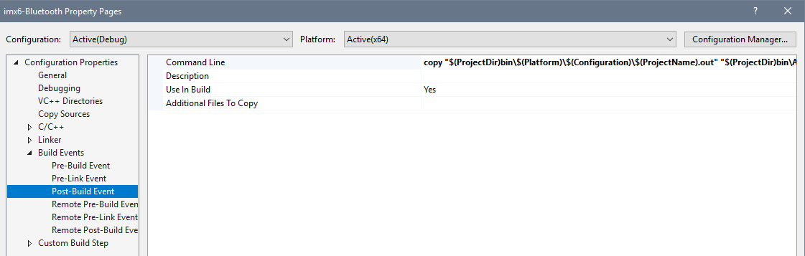

What this is going to do is put the output binary in a default location for use by gdb when we are debugging later. You could skip this if you overrode the defaults in the project properties for the ARM platform configuration.

Now in the project properties for CopyFiles on the General page change the remote build machine to your device. 

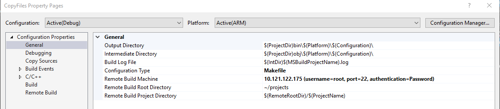

Now go to Build Events > Pre-Build Event. Make sure the platform has ARM active. Add the following command to additional files to copy.
```
..\imx6-Bluetooth\bin\x64\Debug\imx6-Bluetooth.out:=/home/root/projects/imx6-Bluetooth/imx6-Bluetooth.out
```
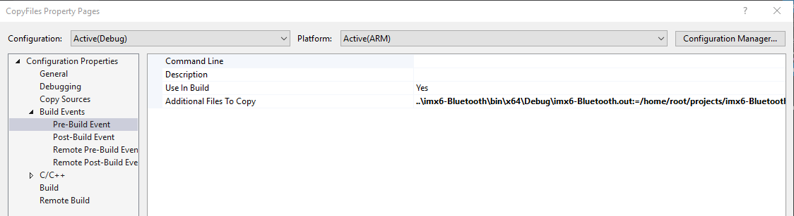

Now under Remote Post-Build Event we need to set the execute bit for the binary.
```
chmod +x /home/root/projects/imx6-Bluetooth/bin/ARM/Debug/imx6-Bluetooth.out
```

**It's important that you use the full absolute path here. Do not substitute /home/root with ~/ as it will be interpreted literally as "~/"**

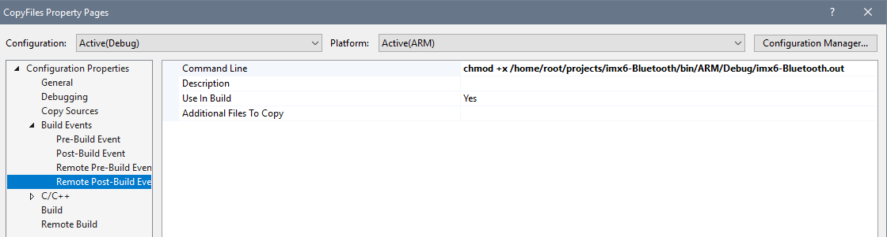

Let's make sure everything builds and copies correctly. Right click the solution and click Build Solution.

If you get an error that the output of the x64 project could not be copied because of a path not found, open the project location in Explorer and create the subdirectories ARM\Debug under the bin folder.

Once everything is building let's get Debugging working.

## Deploy and debug on the iMX.6 ULL device

First turn on your SensorTag and connect to your Colibri IMX6ULL device and run the following command
```
hcitool lescan
```
Make a note of the address your get back for your SensorTag.
```
root@colibri-imx6ull:~# hcitool lescan
LE Scan ...
A0:E6:F8:C3:2C:84 (unknown)
```

Now in Visual Studio change the platform to ARM.

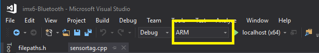

Now in the project properties for imx6-Bluetooth on the General tab change the remote computer from local host to your device. 

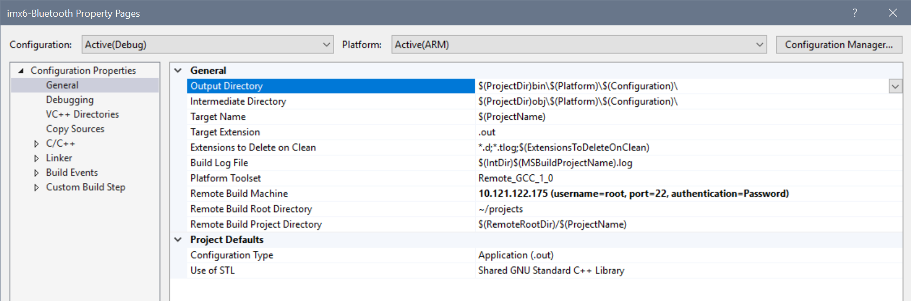

To configure debugging go to the Debugging property page. In program arguments provide your SensorTag address. The device does not have gdb installed, so change debugging mode to gdbserver.

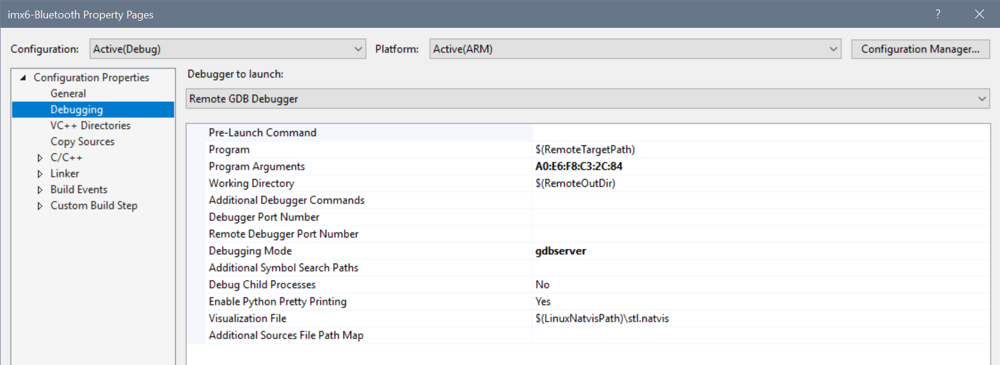

Since this connection doesn't have headers you won't have IntelliSense. If you would like to get it back go to VC++ Directories project properties. Go to the location where your headers were saved for the container connection. Navigate to the subdirectory `usr\local\oecore-x86_64\sysroots\armv7at2hf-neon-angstrom-linux-gnueabi\usr\include`. Now copy the entire path and put the value into the Include Directories field. 

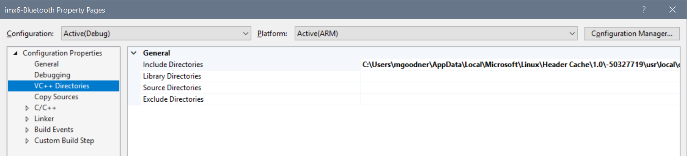

Set a breakpoint around line 319 where the flag for new_measurement is cleared. Now launch the debugger via F5. 

You should see something like the following.

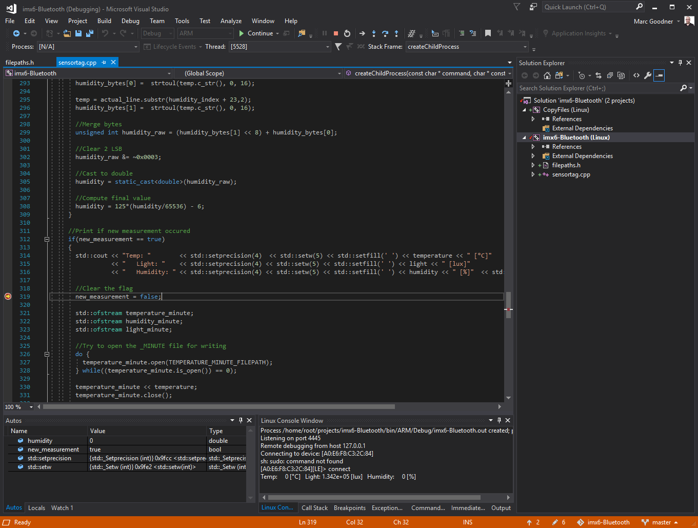

## Conclusion
Now that you have all of this working you can use these techniques to target this or other embedded Linux ARM devices.
